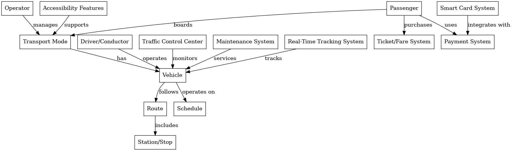

# Entities

| **Entity**                    | **Description**                                                                            |
| ----------------------------- | ------------------------------------------------------------------------------------------ |
| **Transport Mode**            | Represents different types of public transport, such as buses, trains, trams, and ferries. |
| **Vehicle**                   | Individual transport units like buses, train carriages, or trams.                          |
| **Route**                     | A predefined path that a transport mode follows, consisting of multiple stops or stations. |
| **Station/Stop**              | Designated locations where passengers board or alight vehicles.                            |
| **Schedule**                  | Timetables for different routes and vehicles, showing arrival and departure times.         |
| **Passenger**                 | Represents commuters using the transport system.                                           |
| **Ticket/Fare System**        | Includes ticket types (single ride, monthly pass), fare pricing, and discounts.            |
| **Payment System**            | Methods for paying fares, such as cash, contactless cards, mobile apps, and travel cards.  |
| **Operator**                  | The organization or company responsible for running the transport service.                 |
| **Driver/Conductor**          | Personnel operating the vehicles or assisting passengers.                                  |
| **Traffic Control Center**    | The system that monitors and manages vehicle movements, delays, and incidents.             |
| **Maintenance System**        | Tracks maintenance and servicing of vehicles and infrastructure.                           |
| **Smart Card System**         | Contactless cards used for payments and validations.                                       |
| **Real-Time Tracking System** | GPS-enabled tracking for live updates on vehicle locations.                                |
| **Accessibility Features**    | Support for disabled passengers, including ramps, priority seating, and announcements.     |

