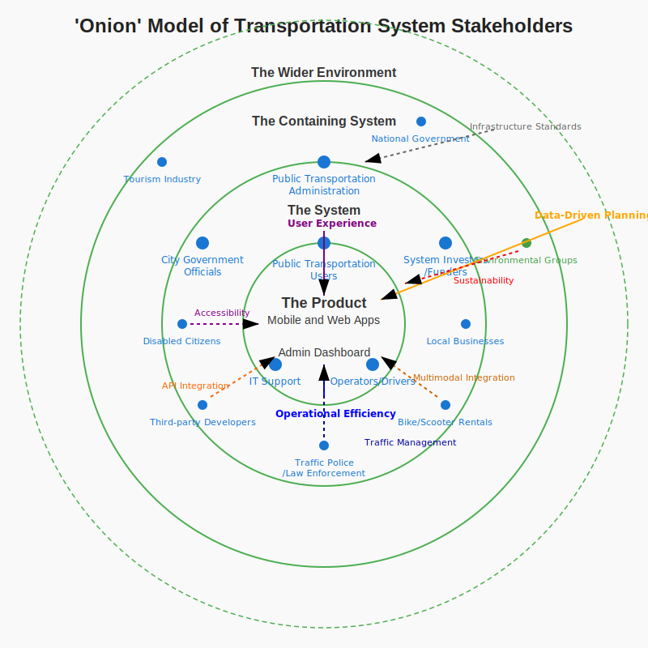

# Onion Model of Stakeholders - Tirana Public Transportation System

This diagram represents the 'Onion' model of stakeholders in the Tirana Public Transportation System. It categorizes stakeholders into four concentric layers:

- **The Product**
- **The System**
- **The Containing System**
- **The Wider Environment**

Each circle contains relevant stakeholders based on their involvement and proximity to the core transportation product.

> The diagram above is an SVG illustration with labeled stakeholder positions around the system.
