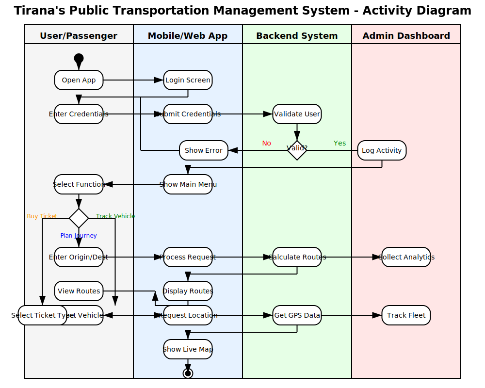

# Tirana's Public Transportation Management System - Activity Diagram

This activity diagram shows the flow of user interaction with the public transportation system. It is structured into four swimlanes:

- **User/Passenger** – User-side actions.
- **Mobile/Web App** – App interface and input.
- **Backend System** – Logic and validation.
- **Admin Dashboard** – Logging and analytics.

Key functions include:

- User login and credential validation
- Journey planning and route calculation
- Real-time vehicle tracking
- Ticket selection
- Backend logging and analytics

---

## Diagram

