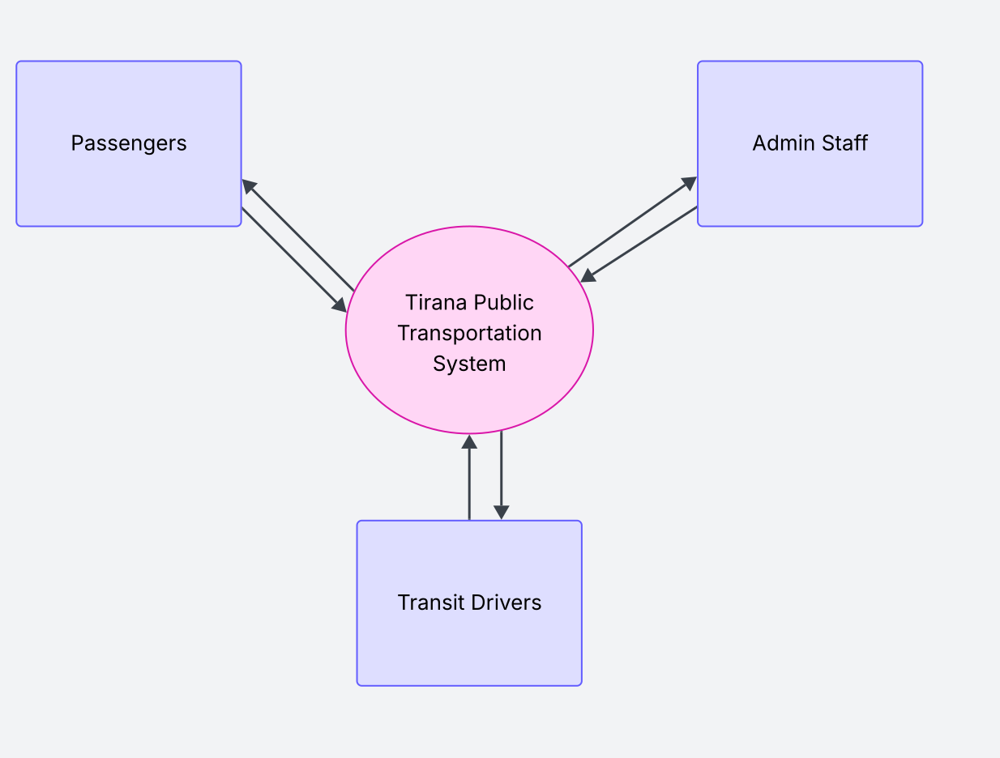
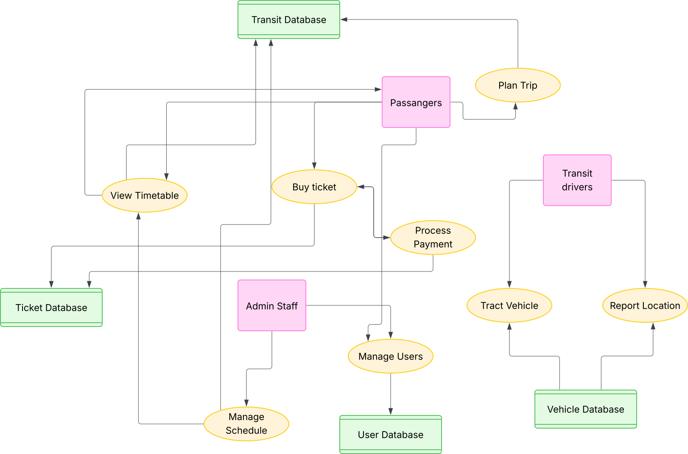
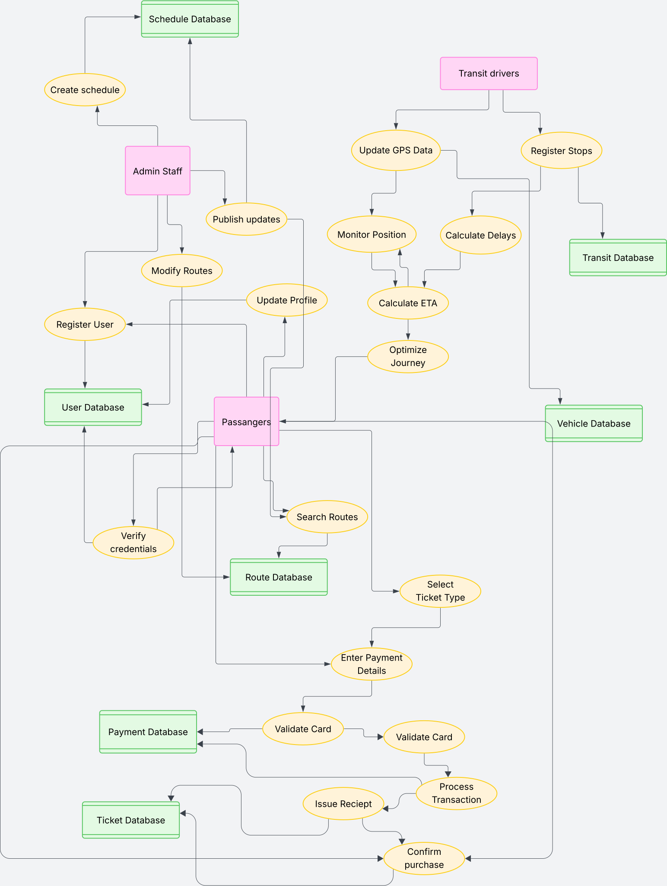

# Tirana Public Transportation System - Data Flow Diagrams

## Overview

This repository contains a set of Data Flow Diagrams (DFDs) for the Tirana Public Transportation System at different levels of abstraction.

## Diagram Hierarchy

### Level 0 - Context Diagram

The context diagram shows the Tirana Public Transportation System as a single process interacting with three external entities: Passengers, Transit Drivers, and Admin Staff.

### Level 1 - Main Processes

This diagram breaks down the system into key processes including Plan Trip, Buy Ticket, Track Vehicle, and Manage Users, along with their interactions with the main databases.

### Level 2 - Detailed Processes

The detailed diagram expands each process into sub-processes showing comprehensive data flows between all components, including process steps like Register Stops, Calculate ETA, Validate Card, and more.

## Purpose

These diagrams serve as documentation for the system architecture and can be used for system development, maintenance, and stakeholder communication.