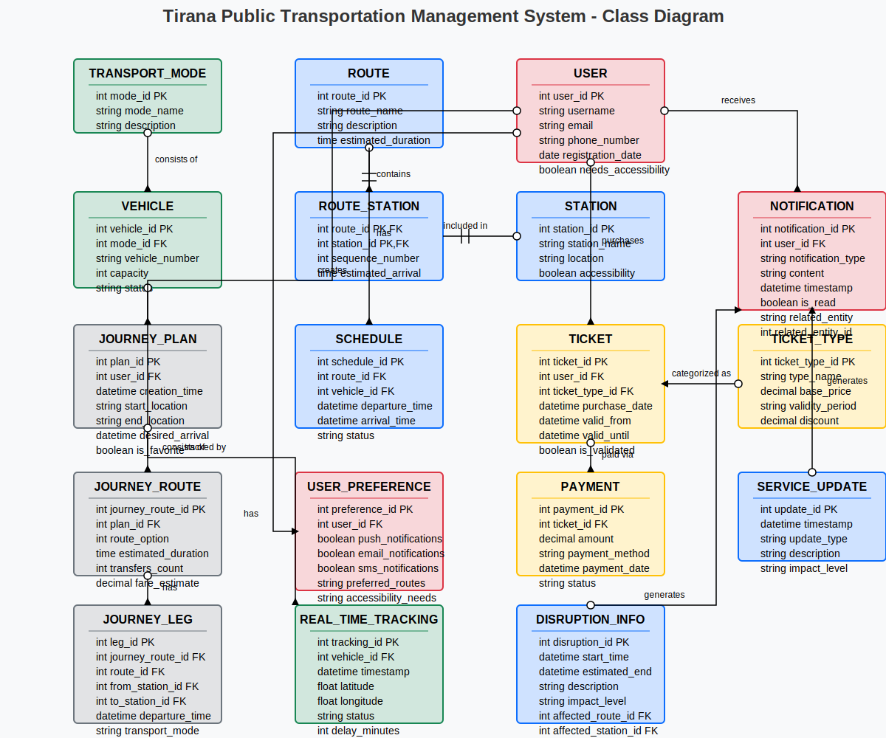

# Class Diagram - University Online Learning Platform

This diagram represents the **Class Diagram** for a University Online Learning Platform. It outlines the key entities in the system and their relationships to each other, providing a structural overview of the platform's database design.

- **Core Entities:** Student, Instructor, Course, Enrollment, Assignment, Submission
- **Relationships:** 
  - Students enroll in Courses
  - Instructors teach Courses
  - Courses have Assignments
  - Students submit Submissions for Assignments
- **Attributes** (examples):
  - Student: student_id, name, email
  - Course: course_id, title, description
  - Assignment: assignment_id, due_date, course_id

