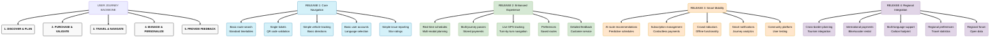

```mermaid

flowchart TD
    classDef release1 fill:#d4f1f9,stroke:#0e76a8,color:black
    classDef release2 fill:#d5e8d4,stroke:#82b366,color:black
    classDef release3 fill:#ffe6cc,stroke:#d79b00,color:black
    classDef release4 fill:#e1d5e7,stroke:#9673a6,color:black
    classDef activity fill:#f9f9f9,stroke:#666666,stroke-width:2px,color:black,font-weight:bold

    %% Main Backbone
    Backbone("USER JOURNEY BACKBONE")
    Backbone ==> A1("1. DISCOVER & PLAN")
    Backbone ==> A2("2. PURCHASE & VALIDATE")
    Backbone ==> A3("3. TRAVEL & NAVIGATE")
    Backbone ==> A4("4. MANAGE & PERSONALIZE")
    Backbone ==> A5("5. PROVIDE FEEDBACK")

    %% Release 1 Features
    R1("RELEASE 1: Core Navigation") ==> R1A1("Basic route search\nStandard timetables")
    R1 ==> R1A2("Single tickets\nQR code validation")
    R1 ==> R1A3("Simple vehicle tracking\nBasic directions")
    R1 ==> R1A4("Basic user accounts\nLanguage selection")
    R1 ==> R1A5("Simple issue reporting\nStar ratings")

    %% Release 2 Features
    R2("RELEASE 2: Enhanced Experience") ==> R2A1("Real-time schedules\nMulti-modal planning")
    R2 ==> R2A2("Multi-journey passes\nStored payments")
    R2 ==> R2A3("Live GPS tracking\nTurn-by-turn navigation")
    R2 ==> R2A4("Preferences\nSaved routes")
    R2 ==> R2A5("Detailed feedback\nCustomer service")

    %% Release 3 Features
    R3("RELEASE 3: Smart Mobility") ==> R3A1("AI route recommendations\nPredictive schedules")
    R3 ==> R3A2("Subscription management\nContactless payments")
    R3 ==> R3A3("Crowd indicators\nOffline functionality")
    R3 ==> R3A4("Smart notifications\nJourney analytics")
    R3 ==> R3A5("Community platform\nUser testing")

    %% Release 4 Features
    R4("RELEASE 4: Regional Integration") ==> R4A1("Cross-border planning\nTourism integration")
    R4 ==> R4A2("International payments\nBike/scooter rental")
    R4 ==> R4A3("Multi-language support\nCarbon footprint")
    R4 ==> R4A4("Regional preferences\nTravel statistics")
    R4 ==> R4A5("Regional forum\nOpen data")

    %% Classes
    class A1,A2,A3,A4,A5 activity
    class R1,R1A1,R1A2,R1A3,R1A4,R1A5 release1
    class R2,R2A1,R2A2,R2A3,R2A4,R2A5 release2
    class R3,R3A1,R3A2,R3A3,R3A4,R3A5 release3
    class R4,R4A1,R4A2,R4A3,R4A4,R4A5 release4
```
