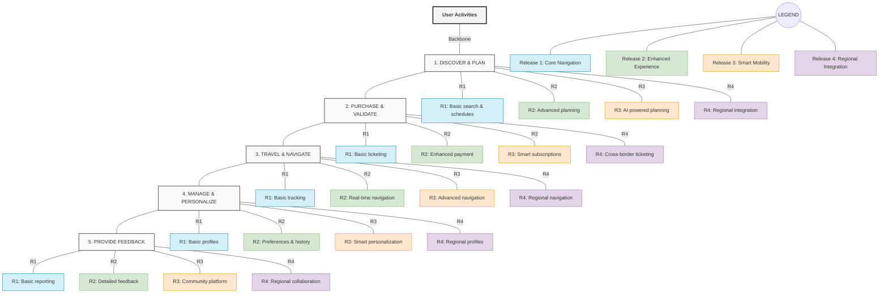

```mermaid

graph TD
    classDef release1 fill:#d4f1f9,stroke:#0e76a8
    classDef release2 fill:#d5e8d4,stroke:#82b366
    classDef release3 fill:#ffe6cc,stroke:#d79b00
    classDef release4 fill:#e1d5e7,stroke:#9673a6
    classDef activity fill:#f9f9f9,stroke:#666666,stroke-width:2px
    classDef backbone fill:#f5f5f5,stroke:#333333,stroke-width:3px,color:#333333,font-weight:bold

    %% Main Structure
    Backbone[User Activities] ---|Backbone| Activity1
    Activity1[1. DISCOVER & PLAN] --- Activity2
    Activity2[2. PURCHASE & VALIDATE] --- Activity3
    Activity3[3. TRAVEL & NAVIGATE] --- Activity4
    Activity4[4. MANAGE & PERSONALIZE] --- Activity5
    Activity5[5. PROVIDE FEEDBACK]

    %% Releases for Activity 1: DISCOVER & PLAN
    Activity1 ---|R1| DP_R1[R1: Basic search & schedules]
    Activity1 ---|R2| DP_R2[R2: Advanced planning]
    Activity1 ---|R3| DP_R3[R3: AI-powered planning]
    Activity1 ---|R4| DP_R4[R4: Regional integration]

    %% Releases for Activity 2: PURCHASE & VALIDATE
    Activity2 ---|R1| PV_R1[R1: Basic ticketing]
    Activity2 ---|R2| PV_R2[R2: Enhanced payment]
    Activity2 ---|R3| PV_R3[R3: Smart subscriptions]
    Activity2 ---|R4| PV_R4[R4: Cross-border ticketing]

    %% Releases for Activity 3: TRAVEL & NAVIGATE
    Activity3 ---|R1| TN_R1[R1: Basic tracking]
    Activity3 ---|R2| TN_R2[R2: Real-time navigation]
    Activity3 ---|R3| TN_R3[R3: Advanced navigation]
    Activity3 ---|R4| TN_R4[R4: Regional navigation]

    %% Releases for Activity 4: MANAGE & PERSONALIZE
    Activity4 ---|R1| MP_R1[R1: Basic profiles]
    Activity4 ---|R2| MP_R2[R2: Preferences & history]
    Activity4 ---|R3| MP_R3[R3: Smart personalization]
    Activity4 ---|R4| MP_R4[R4: Regional profiles]

    %% Releases for Activity 5: PROVIDE FEEDBACK
    Activity5 ---|R1| PF_R1[R1: Basic reporting]
    Activity5 ---|R2| PF_R2[R2: Detailed feedback]
    Activity5 ---|R3| PF_R3[R3: Community platform]
    Activity5 ---|R4| PF_R4[R4: Regional collaboration]

    %% Legend
    Legend((LEGEND))
    R1[Release 1: Core Navigation]
    R2[Release 2: Enhanced Experience]
    R3[Release 3: Smart Mobility]
    R4[Release 4: Regional Integration]

    Legend --- R1
    Legend --- R2
    Legend --- R3
    Legend --- R4

    class Backbone backbone
    class Activity1,Activity2,Activity3,Activity4,Activity5 activity
    class DP_R1,PV_R1,TN_R1,MP_R1,PF_R1,R1 release1
    class DP_R2,PV_R2,TN_R2,MP_R2,PF_R2,R2 release2
    class DP_R3,PV_R3,TN_R3,MP_R3,PF_R3,R3 release3
    class DP_R4,PV_R4,TN_R4,MP_R4,PF_R4,R4 release4
```
