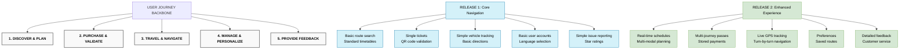

```mermaid

flowchart TD
    classDef release1 fill:#d4f1f9,stroke:#0e76a8,color:black
    classDef release2 fill:#d5e8d4,stroke:#82b366,color:black
    classDef release3 fill:#ffe6cc,stroke:#d79b00,color:black
    classDef release4 fill:#e1d5e7,stroke:#9673a6,color:black
    classDef activity fill:#f9f9f9,stroke:#666666,stroke-width:2px,color:black,font-weight:bold

    %% Main Backbone
    Backbone["USER JOURNEY BACKBONE"]
    Backbone --> A1["1. DISCOVER & PLAN"]
    Backbone --> A2["2. PURCHASE & VALIDATE"]
    Backbone --> A3["3. TRAVEL & NAVIGATE"]
    Backbone --> A4["4. MANAGE & PERSONALIZE"]
    Backbone --> A5["5. PROVIDE FEEDBACK"]

    %% Release 1 Features
    R1["RELEASE 1: Core Navigation"] --> R1A1["Basic route search<br>Standard timetables"]
    R1 --> R1A2["Single tickets<br>QR code validation"]
    R1 --> R1A3["Simple vehicle tracking<br>Basic directions"]
    R1 --> R1A4["Basic user accounts<br>Language selection"]
    R1 --> R1A5["Simple issue reporting<br>Star ratings"]

    %% Release 2 Features
    R2["RELEASE 2: Enhanced Experience"] --> R2A1["Real-time schedules<br>Multi-modal planning"]
    R2 --> R2A2["Multi-journey passes<br>Stored payments"]
    R2 --> R2A3["Live GPS tracking<br>Turn-by-turn navigation"]
    R2 --> R2A4["Preferences<br>Saved routes"]
    R2 --> R2A5["Detailed feedback<br>Customer service"]

    %% Classes
    class A1,A2,A3,A4,A5 activity
    class R1,R1A1,R1A2,R1A3,R1A4,R1A5 release1
    class R2,R2A1,R2A2,R2A3,R2A4,R2A5 release2
```
